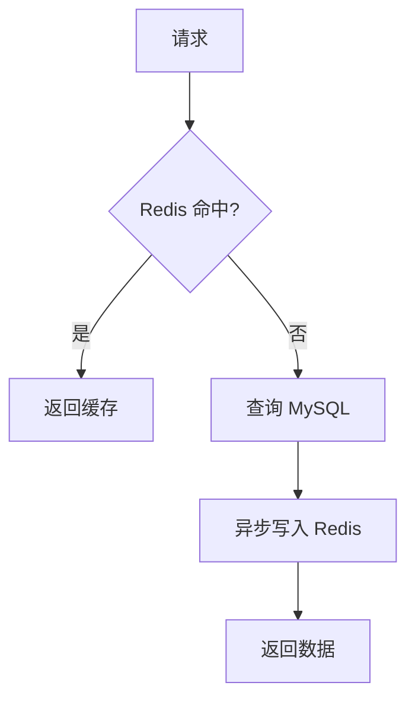

# Redis 键值对设计文档

> 本文档归纳 `apps/user` 层所有 Redis Key 的设计规范及操作函数映射。

---

## 1. Key 命名规范

```
{业务域}:{模块}:{子类型}:{唯一标识}
```

| 前缀类型 | 说明 |
|---------|------|
| `user:` | 用户相关（验证码、信息缓存、二维码等） |
| `auth:` | 鉴权相关（Token） |
| `gateway:` | 网关限流（由 gateway 服务管理） |

---

## 2. Core User Domain（核心用户域）

### 2.1 验证码相关

| Key Pattern | 数据类型 | TTL | Repository | 说明 |
|-------------|----------|-----|------------|------|
| `user:verify_code:{email}:{type}` | String | 传入 | `auth_repository` | 验证码存储<br>type: 1注册 2登录 3重置密码 4换绑邮箱 |
| `user:verify_code:1m:{email}` | Counter | 60s | `auth_repository` | 分钟级限流计数 |
| `user:verify_code:24h:{email}` | Counter | 24h | `auth_repository` | 日级限流计数 |
| `user:verify_code:1h:{ip}` | Counter | 1h | `auth_repository` | IP 限流计数 |

#### 操作函数

| 函数 | 操作 | Key |
|------|------|-----|
| `StoreVerifyCode()` | SET + TTL | `user:verify_code:{email}:{type}` |
| `VerifyVerifyCode()` | GET | `user:verify_code:{email}:{type}` |
| `DeleteVerifyCode()` | DEL | `user:verify_code:{email}:{type}` |
| `VerifyVerifyCodeRateLimit()` | GET × 3 | `1m:`, `24h:`, `1h:` |
| `IncrementVerifyCodeCount()` | Lua INCR + EXPIRE × 3 | `1m:`, `24h:`, `1h:` |

---

### 2.2 Token 相关

| Key Pattern | 数据类型 | TTL | Repository | 说明 |
|-------------|----------|-----|------------|------|
| `auth:at:{user_uuid}:{device_id}` | String(MD5) | AccessToken 过期时间 | `device_repository` | AccessToken 存储（MD5 哈希） |
| `auth:rt:{user_uuid}:{device_id}` | String | RefreshToken 过期时间 | `device_repository` | RefreshToken 存储（原值） |

#### 操作函数

| 函数 | 操作 | Key |
|------|------|-----|
| `StoreAccessToken()` | SET + TTL | `auth:at:*` |
| `StoreRefreshToken()` | SET + TTL | `auth:rt:*` |
| `VerifyAccessToken()` | GET | `auth:at:*` |
| `GetRefreshToken()` | GET | `auth:rt:*` |
| `DeleteTokens()` | Pipeline DEL × 2 | `auth:at:*` + `auth:rt:*` |

---

### 2.3 用户信息缓存

| Key Pattern | 数据类型 | TTL | Repository | 说明 |
|-------------|----------|-----|------------|------|
| `user:info:{uuid}` | String(JSON) | 1h ± 随机抖动<br>空值 5m | `user_repository` | 用户信息缓存<br>空值占位: `{}` |

#### 操作函数

| 函数 | 操作 | Key | 说明 |
|------|------|-----|------|
| `GetByUUID()` | GET → SET | `user:info:{uuid}` | Cache-Aside 读取 |
| `BatchGetByUUIDs()` | MGET → Pipeline SET | `user:info:{uuid}` | 批量读取+回填 |
| `UpdateAvatar()` | DEL | `user:info:{uuid}` | 更新后失效 |
| `UpdateBasicInfo()` | DEL | `user:info:{uuid}` | 更新后失效 |
| `UpdateEmail()` | DEL | `user:info:{uuid}` | 更新后失效 |
| `UpdatePassword()` | DEL | `user:info:{uuid}` | 更新后失效 |
| `Delete()` | DEL | `user:info:{uuid}` | 注销后失效 |

---

### 2.4 二维码

| Key Pattern | 数据类型 | TTL | Repository | 说明 |
|-------------|----------|-----|------------|------|
| `user:qrcode:token:{token}` | String | 48h | `user_repository` | token → userUUID |
| `user:qrcode:user:{user_uuid}` | String | 48h | `user_repository` | userUUID → token（反向映射） |

#### 操作函数

| 函数 | 操作 | Key |
|------|------|-----|
| `SaveQRCode()` | SET × 2 | `token:*` + `user:*` |
| `GetUUIDByQRCodeToken()` | GET | `user:qrcode:token:{token}` |
| `GetQRCodeTokenByUserUUID()` | Pipeline GET + TTL | `user:qrcode:user:{uuid}` |

---

## 3. Social Domain（社交域）

### 3.1 好友关系缓存

| Key Pattern | 数据类型 | TTL | Repository | 说明 |
|-------------|----------|-----|------------|------|
| `user:relation:friend:{user_uuid}` | Hash | 24h ± 随机抖动<br>空值 5m | `friend_repository` | 好友元数据（field=peer_uuid, value=json）<br>空值占位: `__EMPTY__` |

value JSON 字段示例：
```json
{"remark":"","group_tag":"","source":"","updated_at":1736344200000}
```

#### 操作函数

| 函数 | 操作 | Key | 说明 |
|------|------|-----|------|
| `IsFriend()` | Pipeline EXISTS + HGET | `friend:*` | 单次检查 |
| `BatchCheckIsFriend()` | Pipeline EXISTS + HMGET | `friend:*` | 批量检查 |
| `CreateFriendRelation()` | Lua HSET/HSETNX + EXPIRE（条件） | `friend:*` | 增量更新 |
| `invalidateFriendCacheAsync()` | Lua HSET/HSETNX + EXPIRE | `friend:*` | 异步更新双方缓存 |

**Cache-Aside 策略**：
```
1. Pipeline: EXISTS + HGET
2. 命中 → 直接返回
3. 未命中 → 查 MySQL 全量好友 → 异步 HSET 重建
```

---

### 3.2 黑名单缓存

| Key Pattern | 数据类型 | TTL | Repository | 说明 |
|-------------|----------|-----|------------|------|
| `user:relation:blacklist:{user_uuid}` | Set | 24h ± 随机抖动<br>空值 5m | `blacklist_repository` | 拉黑 UUID 集合<br>空值占位: `__EMPTY__` |

#### 操作函数

| 函数 | 操作 | Key | 说明 |
|------|------|-----|------|
| `IsBlocked()` | Pipeline EXISTS + SISMEMBER | `blacklist:*` | 检查是否拉黑 |

---

### 3.3 好友申请缓存

| Key Pattern | 数据类型 | TTL | Repository | 说明 |
|-------------|----------|-----|------------|------|
| `user:apply:pending:{target_uuid}` | ZSet | 24h ± 随机抖动<br>空值 5m | `apply_repository` | 待处理申请<br>member: applicantUUID<br>score: created_at (unix)<br>空值占位: `__EMPTY__` |
| `user:notify:friend_apply:unread:{uuid}` | Counter | 7d | `apply_repository` | 未读申请数量（红点） |

#### 操作函数

| 函数 | 操作 | Key | 说明 |
|------|------|-----|------|
| `Create()` | Lua ZADD（条件） + INCR | `pending:*` + `unread:*` | 创建申请 |
| `ExistsPendingRequest()` | Pipeline EXISTS + ZSCORE | `pending:*` | 检查待处理 |
| `getPendingListFromCache()` | Pipeline ZCARD + ZREVRANGE | `pending:*` | 分页读取 |
| `rebuildPendingCacheAsync()` | DEL + ZADD + EXPIRE | `pending:*` | 异步重建 |
| `GetUnreadCount()` | GET + EXPIRE | `unread:*` | 获取未读数 |
| `ClearUnreadCount()` | DEL | `unread:*` | 清除红点 |

---

## 4. 缓存策略总结

### 4.1 读取策略（Cache-Aside）



### 4.2 写入策略

| 策略 | 适用场景 | 示例 |
|------|---------|------|
| **失效缓存** | 更新操作 | `UpdateBasicInfo()` → DEL |
| **增量更新** | 添加成员 | `CreateFriendRelation()` → HSET |
| **条件更新** | Key 存在时才写 | `Create()` 申请时 Lua 脚本 |

### 4.3 空值处理

| 数据类型 | 空值占位 | TTL |
|----------|----------|-----|
| String | `{}` | 5 分钟 |
| Hash/Set/ZSet | `__EMPTY__` | 5 分钟 |

### 4.4 续期策略

- **概率续期**：1% 读请求触发 EXPIRE
- **目的**：避免热点 Key 同时过期（缓存雪崩）

---

## 5. 错误处理

### 5.1 写入失败

```go
// 发送到 Kafka 重试队列
task := mq.BuildSetTask(key, value, ttl).
    WithSource("Repository.Method").
    WithMaxRetries(5)
LogAndRetryRedisError(ctx, task, err)
```

### 5.2 读取失败

```go
// 降级到 MySQL 查询
if err != nil && err != redis.Nil {
    LogRedisError(ctx, err)
    // 继续走 DB 查询...
}
```

---

## 6. TTL 设计

| 场景 | 基础 TTL | 抖动范围 | 目的 |
|------|---------|---------|------|
| 用户信息 | 1h | ±5min | 防雪崩 |
| 好友/黑名单 | 24h | ±随机 | 防雪崩 |
| 空值缓存 | 5min | - | 防穿透 |
| Token | 配置值 | - | 安全性 |
| 验证码 | 传入值 | - | 业务需求 |

---

## 7. 参考文件

| Repository | 路径 |
|------------|------|
| `auth_repository.go` | [查看](file:///c:/Users/23156/Desktop/go/ChatServer/apps/user/internal/repository/auth_repository.go) |
| `user_repository.go` | [查看](file:///c:/Users/23156/Desktop/go/ChatServer/apps/user/internal/repository/user_repository.go) |
| `device_repository.go` | [查看](file:///c:/Users/23156/Desktop/go/ChatServer/apps/user/internal/repository/device_repository.go) |
| `friend_repository.go` | [查看](file:///c:/Users/23156/Desktop/go/ChatServer/apps/user/internal/repository/friend_repository.go) |
| `blacklist_repository.go` | [查看](file:///c:/Users/23156/Desktop/go/ChatServer/apps/user/internal/repository/blacklist_repository.go) |
| `apply_repository.go` | [查看](file:///c:/Users/23156/Desktop/go/ChatServer/apps/user/internal/repository/apply_repository.go) |
